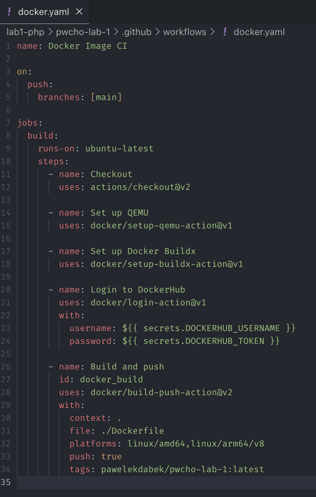

{width="4.34375in"
height="0.8125in"}

Programowanie Full-Stack w Chmurze Obliczeniowej

Laboratorium 2 - Sprawozdanie

Prowadzący: dr inż. Sławomir Przyłucki

Sprawozdanie wykonał: Paweł Dąbek I2N 2.1

Kod docker.yaml:

{width="6.267716535433071in"
height="9.875in"}

Konfiguracja sekretów:

{width="6.267716535433071in"
height="2.736111111111111in"}\
\
Dowód wykonania github actions:\
{width="6.267716535433071in"
height="5.347222222222222in"}

{width="6.267716535433071in"
height="2.0833333333333335in"}
