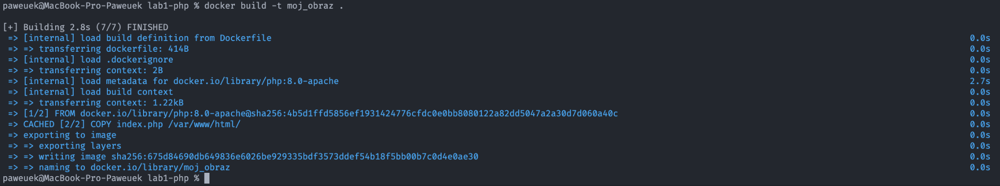
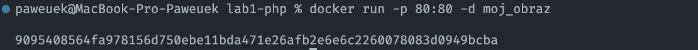
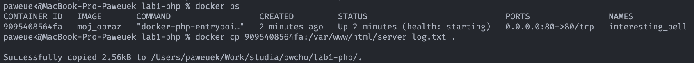
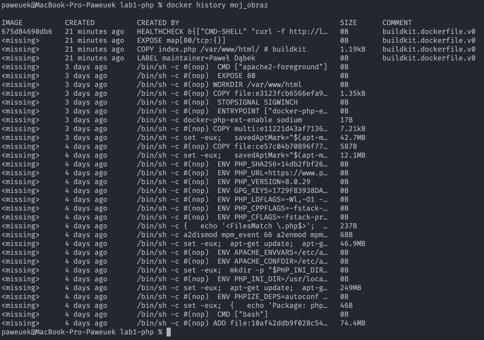
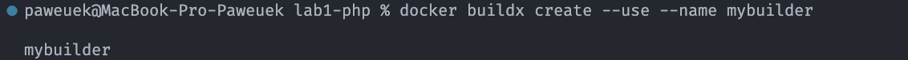
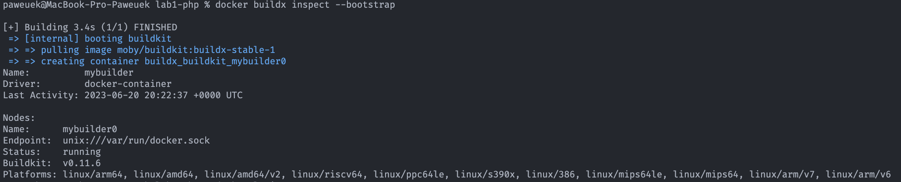
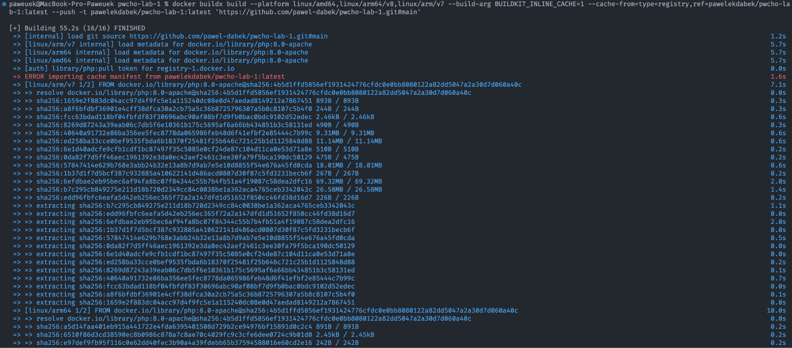
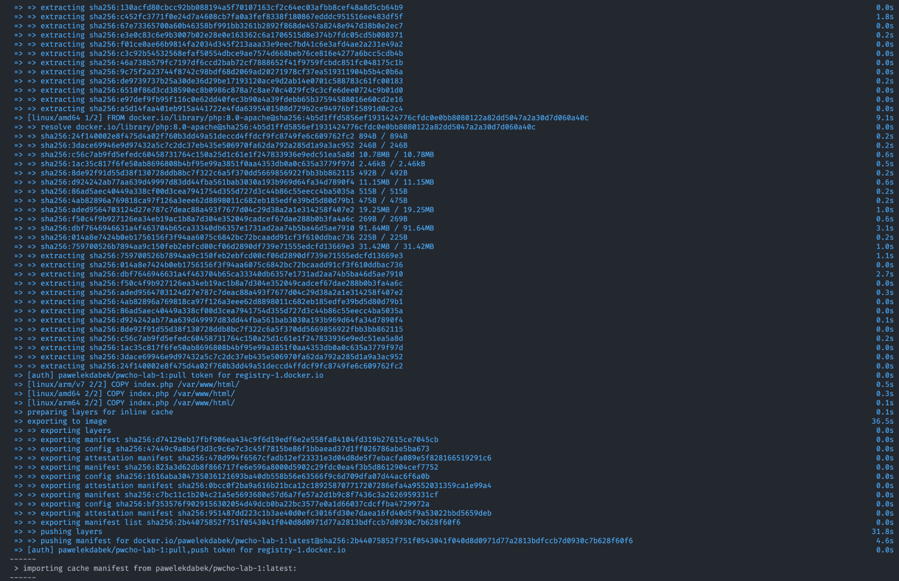
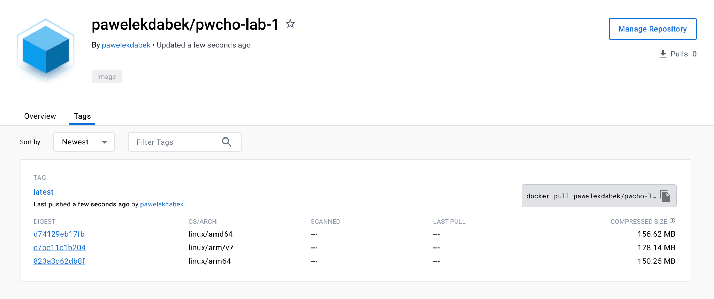

Programowanie Full-Stack w Chmurze Obliczeniowej

Laboratorium 1 - Sprawozdanie

Prowadzący: dr inż. Sławomir Przyłucki

Sprawozdanie wykonał: Paweł Dąbek I2N 2.1

a. Polecenie zbudowania obrazu opracowanego kontenera:

_docker build -t moj_obraz ._

Efekt:

b. Polecenie uruchomienia kontenera na podstawie zbudowanego obrazu:

_docker run -p 80:80 -d moj_obraz_

Efekt:

c. Polecenia sposobu uzyskania informacji, które wygenerował serwer w > trakcie uruchomienia kontenera

_docker cp \<id_kontenera\>:/var/www/html/server_log.txt ._

w celu skopiowania pliku z logami

_docker ps_

w celu ustalenia id_kontenera

Efekt:

d. Polecenie sprawdzenia, ile warstw posiada zbudowany obraz

_docker history moj_obraz_

Efekt:

Część dodatkowa:

Komenda tworząca builder:

_docker buildx create \--use \--name mybuilder_

Efekt:

Sprawdzenie jakie platformy są dostępne:

_docker buildx inspect \--bootstrap_

Efekt:

Budowanie obrazów na architektury linux/arm/v7, linux/arm64/v8 oraz
linux/amd64 za pomocą docker container:\
\
_docker buildx build \--platform linux/amd64,linux/arm64/v8,linux/arm/v7
\--build-arg BUILDKIT_INLINE_CACHE=1
\--cache-from=type=registry,ref=pawelekdabek/pwcho-lab-1:latest \--push
-t pawelekdabek/pwcho-lab-1:latest
\'[[https://github.com/pawel-dabek/pwcho-lab-1.git#main]](https://github.com/pawel-dabek/pwcho-lab-1.git#main)\'_

Efekt:

\
\
Można zauważyć, że wystąpił problem z zaimportowaniem pliku manifest
cache. Spowodowane jest to tym, że był to pierwszy raz budowania obrazów
i cache nie był jeszcze dostępny. Przy następnych budowaniach natomiast
zostanie on poprawnie wykorzystany.

Efekt:

